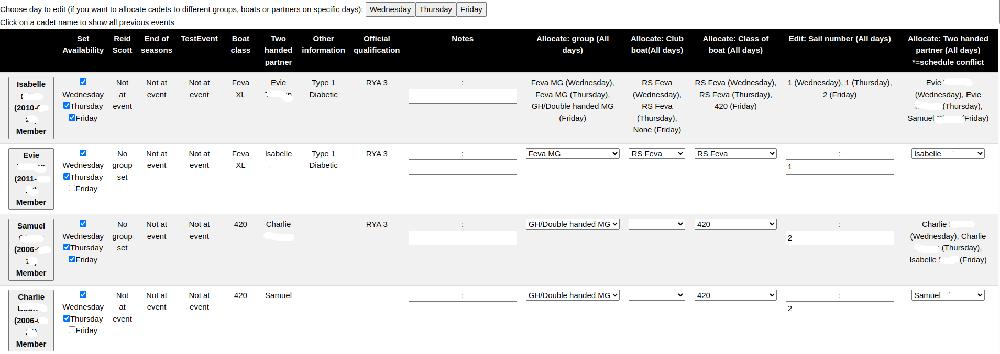

To access the page to allocate groups, boats, club boats and sailing partners, from the **main menu** select **Events**, choose your event, and then click on **Sailors, groups and boats**
___

[TOC]

# Overview of the group allocation page

The group allocation page is used to allocate sailors to training groups, say which boat they are sailing, with which sail number, and (for two handed boats) with whom. 

There are two expand► buttons to look at the [summary](#seeing-a-summary) and change the [sort order](#changing-the-sort-order) for the main table.

Then there are a series of buttons allowing you to [edit specific days in the event](#choosing-different-days), which is useful if sailors are changing partners or groups.

Finally, there is the main table of sailors who are registered at the event. This excludes any cancelled registrations. To change a sailors registration status, go to the [registration editing page](registration_editing_help.md).

# Overview of the sailors table

***
***

***
***

From the left, the columns in the sailors table are:

- A button with the sailors name, DOB and membership status on. Click to [see more details about a sailor](#see-more-information-about-a-sailor).
- Some checkboxes to set the [sailors availability at the event](#changing-sailor-availability)
- The groups they were at for the previous three events in the Skipperman data, which [can be changed](#changing-the-previous-events-that-are-shown). 
- Relevant information for allocating their group which has been entered in the registration form. This will depend on what is in the registration form, and the [field mappings](WA_field_mapping_help.md) used to import the data.
- The highest qualification that the Cadet has achieved.
- A notes field - enter any relevant information about the sailor that will be a useful aide memoire. Do not use for health information (that is on the [registration editing page](registration_editing_help.md))
- Allocate: group. A dropdown for [allocating training and racing groups](#allocating-groups-club-boats-and-boat-classes-and-editing-sail-numbers)
- Allocate: class of boat. A dropdown for [allocating the class of boat they wish to sail](#allocating-groups-club-boats-and-boat-classes-and-editing-sail-numbers)
- Edit: Sail number. [Edit the sail number the cadet is using](#allocating-groups-club-boats-and-boat-classes-and-editing-sail-numbers). 
- Allocate: Two handed partner. [Select a two handed partner for the cadet to sail with](#creating-sailing-partnerships).

# Ensuring you have all the information to do group and boat allocation

This needs to be done before you import the event data, by setting up [field mappings](WA_field_mapping_help.md).

The following Skipperman fields, if present in the mapping, will be displayed in the table of sailors at the event.

These should be used at all events:

- Sail number (this will automatically be added to the cadets)
- Two handed partner (alternatively if 'Crew first name' and 'Crew surname' are mapped, these will be shown in Skipperman as a two handed partner) - unless it is a singlehander only training event.
- Other information

The following should also be included for training events:
- Desired boat (use instead of boat class since it gives people the option of borrowing a club boat in one group, or having a backup group)
- Wants MG (required if eg the boat class alone isn't enough to work out which group they should be in. Can also be used to specify if you want eg a Seamanship or Cadet Adventure course)
- Boat ownership - to indicate [if a club boat is required](#allocate-club-boat))
- Previous experience (Should only be used for cadets who are new to the club, otherwise we use the Skipperman records)
- Can swim 25m 
- Has bouyancy aid 

The following should be used at racing events: 
- Boat class 

The following are not recommended for use, but are kept for backwards compatibility with previous events:
- Highest qualification (We advise this isn't used as it's better to use the Skipperman qualification record)
- Preferred group (We advise this isn't used, since we should allocate groups, not parents; only use if there is a choice of group eg Cadet Adventure)

## Changing the previous events that are shown

Skipperman defaults to showing the previous 3 events that were held to help choose groups, however at various times of the year this might not be helpful. You can change the groups shown by clicking on the ►Select previous events to show above the sailors table.

Click the events you want to show; this can be as few or as many as you like (although obviously you need at least one event, and if you include too many the table will be become unwieldy.).

Then click on `Save changes to event selection` or `Use default (last 3 events)`.

# Allocating groups, club boats and boat classes; and editing sail numbers.

Don't forget to save once you have made any changes to groups, club boats, boat classes and sail numbers.

## Allocating groups

You need to allocate sailors to training or racing groups, depending on the event:

- at a single class training weekend, eg Feva training, it isn't necessary to do this but it does make everything tidier
- at a racing event eg Frostbite, you have the option of putting sailors in MG racing groups, but again it isn't necessary. If you don't, the only problem is you won't be warned if parents are race coaching their children.
- for training weekends: you must allocate sailors to training or MG race training groups
- at Cadet week: you must allocate sailors to training or MG racing groups

Choose the appropriate group from the dropdown, bearing in mind the sailors qualification levels and the boat they are likely to sail. If neccesary consult the SI and / or relevant instructors.

If you can't see the group you want, you need to visit the [configuration pages](configuration_help.md#sailing-groups) as the group may be hidden or need to be added.

## Allocate club boat

To allocate a club boat, just select the blank dropdown and choose the required boat. If you don't see the club boat you want, go to the [configuration pages](configuration_help.md#club-dinghies); it might be hidden or a new boat you need to add.

Skipperman doesn't know how many club boats are available - use the [summary](#seeing-a-summary) tables to see how many you have allocated.

Note this will include boats allocated to instructors and other helpers in the [patrol boat](patrol_boat_help.md#allocating-club-sailing-dinghies-to-instructors) page.

There is an official skipperman field `Boat ownership`. If this is used in the [event field mapping](WA_field_mapping_help.md), so you can see if they want a club boat. Check that there are enough club boats available (using the [summary](#seeing-a-summary) information), and if required enforce a priority for borrowing them. If a cadet doesn't get a club boat that they need, make sure you allocate them to a backup group.

## Boat classes and sail numbers

To enter the boat class just use the dropdown. If you don't see the information you want, go to the [configuration](configuration_help.md#boat-classes) as the boat may be hidden or need adding.

It can be quite boring to allocate boat classes to everyone at an event. If you click the `Autofill Boat Class` button at the top it will guess which boat class that each sailor is sailing in. Make sure you check they look correct.

# Creating sailing partnerships

## When the partner is registered at the event

To create a sailing partnership, just select the 'allocate two handed partner' dropdown. You will see a list of sailors who can be made partners and put on the same boat. 

If you see a * next to a sailors name in the dropdown, that means there is a scheduling conflict - the sailors aren't at the event on the same day. If you add them as a partner, you will need to [edit event days individually](#dealing-with-different-days) to deal with this.

If a sailor isn't listed at all in the dropdown, that means there are no days at the event when both the sailor and their potential partner are there.

When we add a partner, any previous group allocation, boat name, club boat allocation and sail number for the partner that has been added are removed and replaced with those from the relevant sailor. This makes sense, partners should be in the same group and on the same boat! You can save time then by selecting the group, club boat, boat class and sail number before adding a partner.

## When the partner isn't registered

Unregistered partners will usually occur at racing events, where there is the option to register the boat and not the individual helm and crew.

Consider this Feva group:

***
***

***
***

- Hector wants to sail with Hattie. This is Harriet's nickname, and she is registered.
- Isabelle wants to sail with Evie. But Evie is not registered.
- Harriet wants to sail with Hector, who is registered.

To set up the partnership between Isabelle and Evie, we would first need to register Evie. This can be done by clicking the `Add Evie ... as new cadet` button.  We then have the option of adding Evie as an entirely new sailor, or selecting her if she is already in the Skipperman database (we can't automatically identify her, since we don't have her date of birth which is required). 

Once this is done, everything in Isabelle's registration record will be duplicated on to Evie's; sailing group, club boat allocation, boat class and sail number; but also emergency contact numbers and health information so make sure these are appropriate for each sailor. 

More help on adding sailing partners can be found [here](help_adding_partner.md).

Note: Why do we see the `Add Hattie.. as new cadet` button for Hector? It's because Skipperman doesn't know that Harriet and Hattie are the same sailor. If you tried to add Hattie as a new registrant, then you would eithier:

- add Hattie as a duplicate cadet - the system would warn you about this and hopefully you wouldn't do it! 
- try and register Harriet to the event. This will throw up an error since Harriet is already registered.

## Subsequent changes to sailing partners

If you make any change to one half of a sailing partnership (boats, sail numbers or training groups), it will automatically be applied to the other member.

## Remove a sailing partner

To remove a sailing partner, click on the `Remove partnership` button under their name. You only have to do this on one partner - the other will automatically lose their partner.

Their partnership status will change to `Unallocated`. All the other information (group, boat class, club boat and sail number) will be unchanged so you will need to update that as required.

Note: There is no difference in behaviour between Unallocated and Singlehander; but marking a cadet as Unallocated is helpful if you need to find a new partner for them.

# Adding a sailor manually

You may also want to add sailors to an event who:

- haven't been officially registered. This is very useful for racing events, when you want to produce an accurate spotter sheet.
- who you know *will* be registered but haven't yet been
- or you know *has* been registered, but you don't want go through the hassle of [importing data from Wild Apricot](import_registration_data_help.md) 

Click on the `Add unregistered sailor` button at the bottom of the sailors table, and then eithier choose an existing sailor, or add a new one.  See [here for more help](manually_adding_a_sailor.md).

Note that adding a sailor manually will set their registration status to 'Manual'. Since there is no registration information, all the registration fields will be blank. 

If the sailor is subsequently registered on Wild Apricot, and the data imported, you will get an error message: 

> `ACTION REQUIRED: Cadet John Smith (2000-01-01) Member appears more than once in WA file with multiple active registrations - ignoring any possible changes made to registration - go to WA and cancel one of the registrations please!`

You have two options:

- Change the original manual registration to `Cancelled` in Skipperman. Then you can re-import the Wild Apricot file with the new registration. This has the disadvantage that you will lose any changes / additional information added in Skipperman. 
- Ignore the error. This has the disadvantage that you will need to manually update the original manual registration with any relevant information from Wild Apricot.

NOTE: In a future version of Skipperman the system will allow you to replace the manual registration with an official one automatically.

# See more information about a sailor

Sometimes when allocating groups you will want more information about a sailor. Click on their name, and you will see a full list of their previous event history, plus their qualifications. Qualifications will show as eithier eg 'RYA 1' indicating the sailor holds that, or 'RYA 1: 50%' showing they have done half the [ticks](ticksheets_help.md) required for that qualification.

Click on the sailors name again, or on anyone elses nam, and the additional information will disappear.

# Changing the sort order

It can sometimes be helpful to sort the sailors table in different ways. Click the `Change sort order` button. You can move the various categories up and down, and then click `Back` to return to the allocation screen.

# Seeing a summary

If you want to see a summary of how many sailors you have put in each group, or how many club boats there are allocated, or how much of each boat class is sailing; then click on the appropriate ► at the top of the page.

## Seeing how many club boats are allocated, and if you have any left 

If you click on ►Club boats, you will see a table of how many club boat spaces have been allocated for each day (note these are the number of *sailors* allocated to club boats, not the number of boats). In the far right column is the number of boat spaces available for this event. These are populated by default with values that can be changed in the [configuration](configuration_help.md#club-dinghies). You can change these values just for this event by modifying the numbers and hitting `Update club boat limits for event`.

If there are more sailors allocated to a club boat on a given day than there are spaces left, you will see a * in that column for the appropriate day.

# Changing sailor availability

You can change the days a sailor is attending an event by modifying the checkboxes under `Set availability`.

If you do this to someone with a sailing partner, you may get a warning like `Isabelle was sailing with partner Evie, now they aren't sailing: Evie has no partner on Friday`. You can [edit different days](#dealing-with-different-days) to resolve this.

You should also go the [volunteer rota](volunteer_rota_help.md) and check the [warnings](volunteer_rota_help.md#warnings) to see if this has any effect on your rota, for example if Isabelle had a linked volunteer who may also not be around on Friday.

# Dealing with different days

Sometimes sailors are awkward, and are in different groups, or sailing with different people on different days.

Consider these four sailors:

***
***

***
***

Now suppose that Evie cannot sail on Friday, and nor can Charlie. If we update their availability and save:

***
***

***
***

Notice that the two handed partner column for Isabelle and Samuel has changed, reflecting the fact they now no longer have partners on Friday. Also, these are no longer values that can be changed with a dropdown. Instead, we need to click on the `Friday` button above the sailors table:

***
***

***
***

Firstly, notice that Charlie and Evie are shown as not sailing. We could reverse this by clicking on the `Cadet not sailing today - click to change` button, or updating the availability checkboxes.

You can also see that Isabelle and Samuel are now showing as not having sailing partners. If we add Isabelle as a sailing parter to Samuel:

***
***

***
***

Isabelle has had her original allocations overwritten by Samuels, as normally happens when we [allocate sailing partners](#creating-sailing-partnerships).

Finally, if we click on `Show all day view` we can see the fruits of our labours:

***
***

***
***

As a general rule then:

- In the 'all day' view we can make changes to all days a sailor is registered for, unless they have different allocations across different days in which case they will be displayed as text which cannot be edited.
- Changes made in the individual day view will only affect that day

This can also be done with singlehanded sailors, who can be put in different sailing groups and/or in different boats on each day.

# Quick reports

If you choose one of the two 'quick report' options in the menu, you can run a [group allocation report](group_allocation_report_help.md) or a [spotter sheet](spotter_sheet_report.md). These reports will run with the printing options currently set up and they **will not be published to the public**. If you want to publish them, or change the report settings, go to the relevant part of the [reports menu.](reporting_help.md).