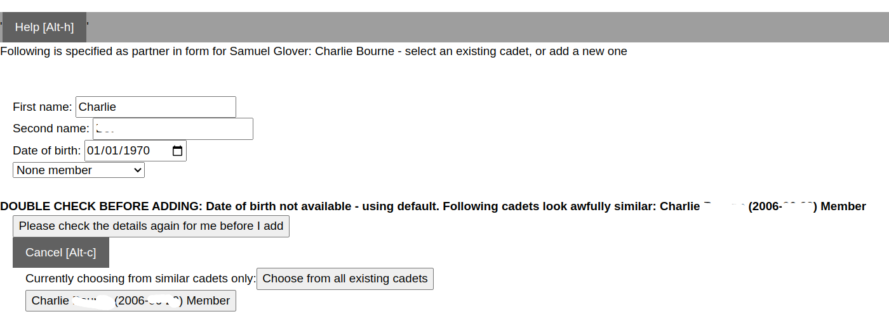

When [allocating cadets to groups](group_allocation_help.md), boat classes and (optionally) club boats; you can also allocate sailors to sailing partners if they are in two handed boats.

For training events and cadet week (where you definitely have to register, and pay in advance), the sailing partner should be seperately registered. However, for racing events it's common to have a registration form that asks for the Helm and Crew, and doesn't require them both to register. If there is a two handed partner mentioned in the registration, and if they don't seem to be already registered, Skipperman will give you the option of adding the sailing partner to the registration list so they can be properly paired. If this is not done, then the [spotters report](spotter_sheet_report.md) won't be accurate. 

It is recommended that, to save time, you allocate a boat class, sail number, club boat (and optionally training group) to the original sailor before adding their partner. Then adding their partner will duplicate this information to the sailor you have added.

Note: A two handed partner will be added with registration status 'Manual'. 

The details of the two handed partner from the form are shown. Note that we don't know that their date of birth, since that isn't a field we normally use for racing events (and in any case it would apply to the helm). 

## If this is an existing sailor

You will probably see a warning that it looks like there are existing sailors with very similar or identical names. You can click on a sailors name to register them for the event, or click on `Choose from all existing cadets` if you think they are a sailor that isn't shown. You can sort this list of sailors in various ways to find the sailor you want. You also have the option of clicking `See similar cadets only`.

Once you have chosen the sailor they will be registered to the event with the existing sailors registration details, boat class, sail number, club boat and training group copied across (where relevant).

If they are already registered you will get an error message - sailors who are already registered should be paired up by selecting them as two-handed partners from the dropdown menu in the [group allocation page](group_allocation_help.md).

## If this is a new sailor - not on Skipperman

 **It's really important that you don't add duplicate cadets to the Skipperman data**

But if you are sure this is a new cadet: enter their name and date of birth (making any corrections in the relevant input fields), and membership status. 

Date of birth: You won't usually have the date of birth for a new sailor, unless they have done a WA registration already. If they are a visitor don't worry about including this, change the DOB status to 'Non member - don't need to know'. 
If they are a member that is new to Skipperman, and you aren't sure of their date of birth or it hasn't been included in the registration form, then choose DOB status 'I need to confirm - leave blank for now'. You can [edit the date of birth later](view_and_edit_individual_cadet_help.md). 

For membership status:

- if you are sure they are a paid up member, select `Member`
- if you are sure they are a non-member (visitor), select `None member`
- if you aren't sure, select `Unconfirmed member`

Membership or otherwise can be confirmed by [importing a list of club members](import_membership_list_help). 

Remember it is possible to edit the cadet details, and these can also be updated by importing a list of club members from Wild Apricot, so don't worry too much if these aren't precisely right.

Once you are confident then click on `Please check the details again for me` (if it's on screen), and then on `Yes - these details are correct - add this new cadet`.

## If you change your mind

Click `Cancel` and no two handed partner will be added.

# Effects of adding a sailor manually

Note that adding a sailor manually will set their registration status to 'Manual'. Since there is no registration information, all the registration fields will be blank. 

If the sailor is subsequently registered on Wild Apricot, and the data imported, you will get the following message:

> `There have been important changes for event registration information about cadet John Smith (2000-01-01) Member`
> `Sailor John Smith (2000-01-01) Memberis still active but status has changed from Manual to Paid: select status `

If they have been registered with different days attending, that will also be higlighted. Click on `Use new data imported from latest file` to update Skipperman.

