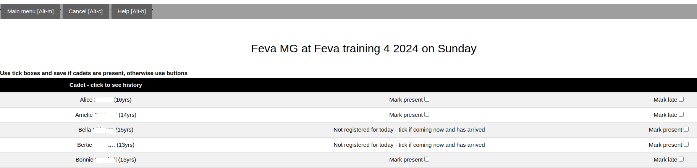

To use Skipperman as a paperless attendance register, from the Main menu click on **Instructors**, then select the event, then choose the group, and finally click on **Mark attendance** 
___

# Initial registration

When you first go to do attendance on a given day, you will see something like this:

Notice that Bella and Bertie have said they are not coming to the event on this day. 

## Tick all the cadets individually

- If a cadet is coming: tick the checkbox next to 'Mark present'
- If a cadet will be coming but is late: tick the 'Mark late' box
- If a cadet wasn't supposed to be coming, but has turned up, tick the 'Mark present' box.

When you have finished, click `Save changes - anyone not ticked will be marked as absent`.

For example, if you click on the following and then click on save changes:

- Alice will be marked as late, but coming later (note - if you accidentaly tick present AND late, the sailor will be marked as late)
- Amelie will be marked as present
- Bella will be marked as present
- Bertie will remain as 'not coming'
- Bonnie will be marked as absent

## If all the cadets are present

To save time, you can click on `Mark all registered today as attending (unless late)`. This will mark **all** cadets as present, unless:

- they were already ticked as late
- they weren't supposed to be coming, and you have **not** already ticked them as unexpectedly present.

For example, if you click on the ticks as above and then click on `Mark all registered today`:

- Alice will be marked as late, but coming later (note - if you accidentaly tick present AND late, the sailor will be marked as late)
- Amelie will be marked as present
- Bella will be marked as present 
- Bertie will remain as 'not coming' (since wasn't supposed to be coming, and no explicit unexpectedly present tick) 
- Bonnie will be marked as present (this is different from before when we clicked `Save changes`)

# During the event

## Sailors who were late but have now arrived

Select `Late but has now arrived`. You will now see the same options for a cadet marked present.

## Unexpected arrivals

If a cadet like Bertie wasn't registered, but turns up anyway, you can click `Not registered for today - click if coming now and has arrived`. You will now see the same options for a cadet marked present.

## Temporary absences

Sometimes sailors will leave a group for a brief period (make sure you know where they are, and that they are with a suitable adult). Click on `Taking temporary absence from group`. When they return press `Back after temporary absence`.

## Mistakes

If a cadet was marked present, but is actually absent, click on `Accidentally marked as present - actually absent`.

Conversely, if a cadet is marked absent (or just rocks up), click on `Was marked absent but arrived unexpectedly`.

## Returning to parents, or club precincts

When the training has finished for the day, you can mark the cadets are returned by checking the `Returned to parents` (if under 11) or `Returned to club precinct` (if 11 or older). Sailors under the age of 11 must be returned to their parents. The age of the cadet is shown in the first column as a helpful check.

# Seeing attendance history

If you want to know where a cadet has been, click on their name. You will then see the dates and times of when their attendance status changed. Click on the button again, or on another button to see another cadet's history.

